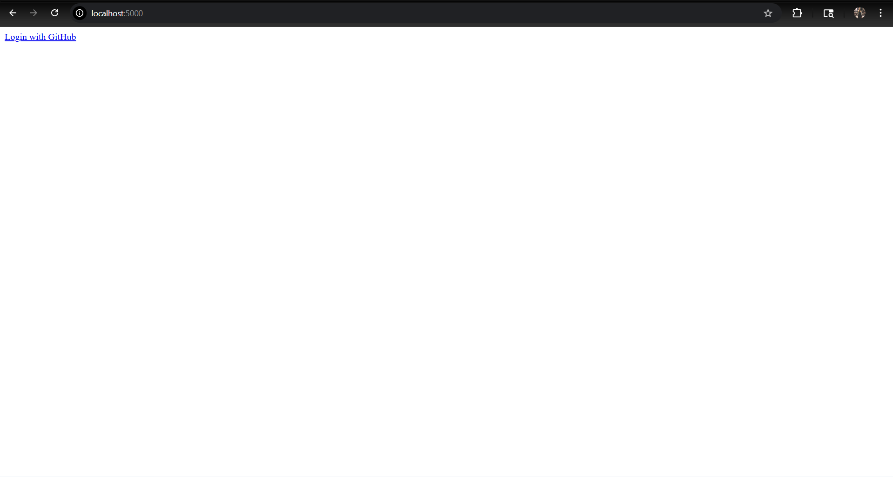
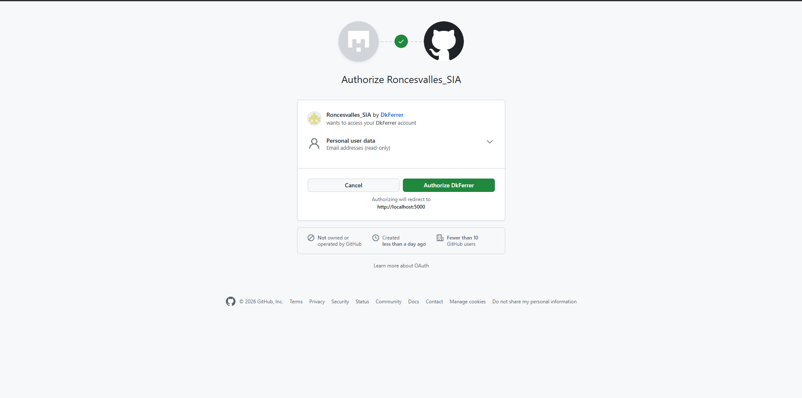
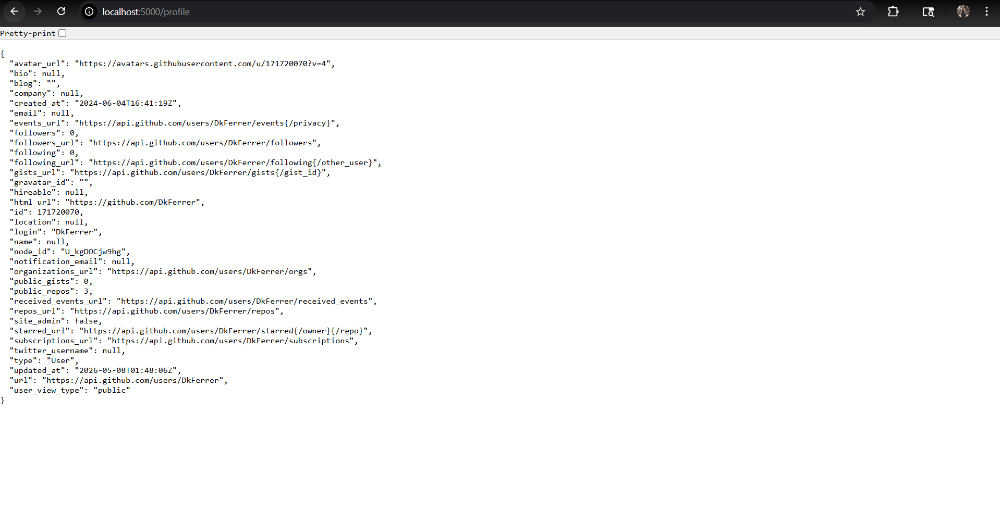
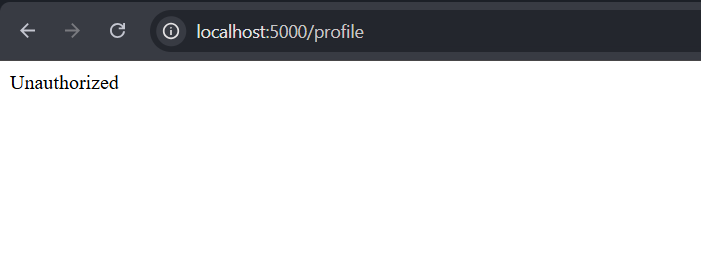
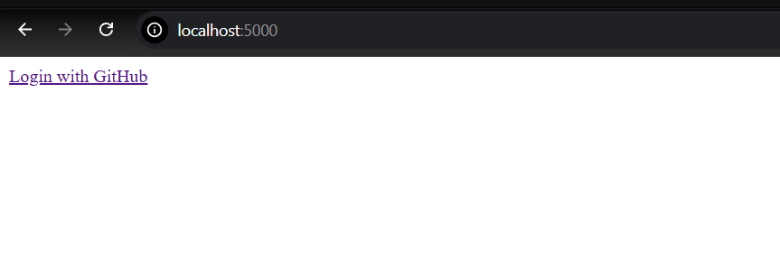

# GitHub OAuth with Flask
**Student:** Lea Roncesvalles  
**Subject:** Systems Integration and Architecture  
**School:** University of Nueva Caceres  

---

## Overview
A Flask web application that implements GitHub OAuth 2.0 authentication 
using Authlib. Users can log in with their GitHub account and view 
their raw profile data.

---

## Requirements
- Python 3.14.4
- Flask
- Authlib
- Requests

---

## Installation

### 1. Clone the Repository
git clone https://github.com/DkFerrer/Roncesvalles_SIA.git
cd Roncesvalles_SIA

### 2. Create Virtual Environment
python -m venv venv
venv\Scripts\activate

### 3. Install Dependencies
pip install -r requirements.txt

### 4. Configure GitHub OAuth

- client_id = 'Ov23liqbgdBpCAsAz5aJ'
- client_secret = 'f6f52c0aeec2aa332a694763fc99c14a952d9eb4'

### 5. Run the Application
python app.py

---

## Routes
| Route | Description |
|---|---|
| `/` | Home page with login link |
| `/login` | Redirects to GitHub authorization |
| `/callback` | Handles GitHub OAuth callback |
| `/profile` | Shows authenticated user data |
| `/logout` | Clears session and logs out |

---

## Screenshots
### 1. Login Page

### 2. GitHub Authorization

### 3. Profile Page

### 4. Unauthorized Access

### 5. Logout Result
